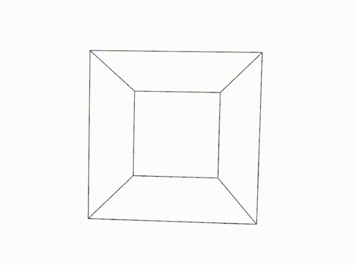

# Hypercube renderer

This renders an n-dimensional [hypercube](https://en.wikipedia.org/wiki/Hypercube) and rotates it about all of its planes of rotations.

## Examples

A simple 3D cube perspective projected.

4D Hypercube (Tesseract) Perspective projected

4D Hypercube (Tesseract) Orthographically projected

5D Hypercube (Penteract) Perspective projected 

6D Hypercube (Hexeract) Perspective projected

And last but not least, just for some fun, a rendering of a 10D Hypercube (in perspective projection).

## Dependencies
- nannou
- ndarray
