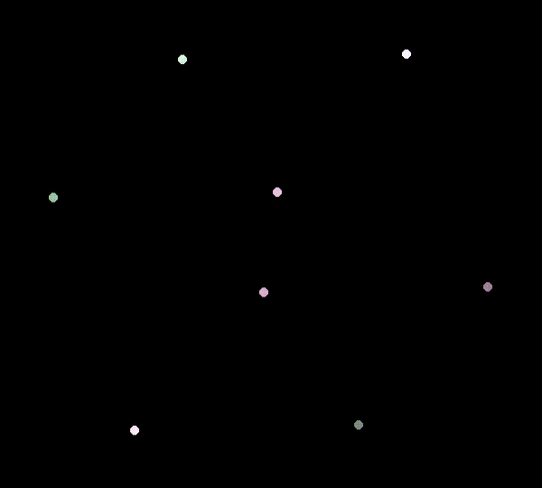

# 3D Cube Renderer

A simple renderer for a 3D cube using rotation matrices in numpy.

## Example

Cube rendered with faces.

Cube rendered where each vertex is a dot.

Wireframe version of the cube rendered.

Irregular movement. Normal vector on front face is visible. This is with zero drag.

